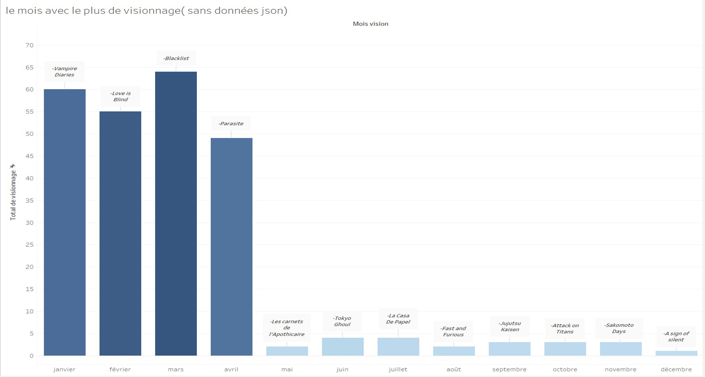
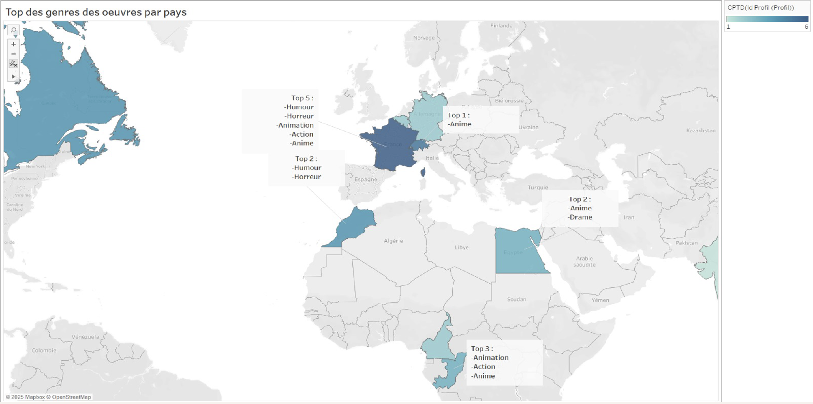
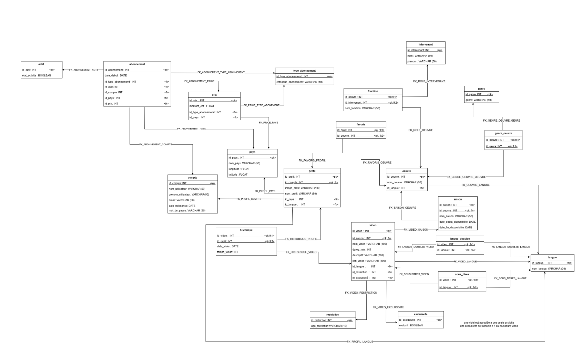
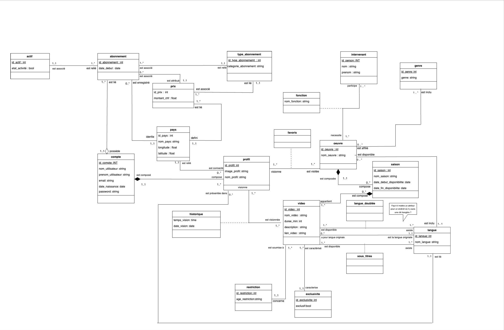

# Prime Video Database Project

## Objectif
Concevoir et analyser une base de données relationnelle pour une plateforme de streaming afin d’améliorer l’expérience utilisateur et les systèmes de recommandation.

## Compétences et outils
- Modélisation de base de données (UML)
- SQL (requêtes complexes)
- Normalisation (3NF)
- Analyse de données
- Visualisation de données (Tableau)

## Description du projet
- Conception d’un schéma relationnel complet (comptes, profils, vidéos, abonnements, etc.)
- Développement de requêtes SQL avancées permettant :
  - d’analyser les genres les plus populaires par pays
  - d’identifier les tendances de visionnage selon les périodes
  - de proposer un système de recommandation basé sur les préférences et les langues
  - de détecter les contenus prochainement indisponibles
- Implémentation de triggers SQL pour garantir la cohérence des données
- Création de visualisations avec Tableau pour interpréter les résultats

## Résultats
- Meilleure compréhension des comportements de visionnage
- Identification de tendances saisonnières
- Mise en évidence de facteurs utiles pour améliorer les recommandations

## Visualisations

### Analyse des visionnages par mois
- Identification des périodes de forte activité
- Mise en évidence des contenus les plus visionnés

### Analyse des genres par pays
- Comparaison des préférences culturelles selon les pays
- Identification des genres dominants

## Modélisation de la base de données

### Diagramme relationnel

### Diagramme de classe

## Technologies
- MySQL
- phpMyAdmin
- Tableau
