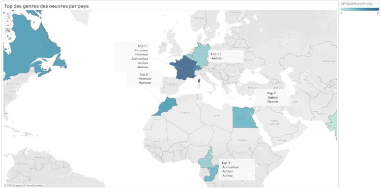
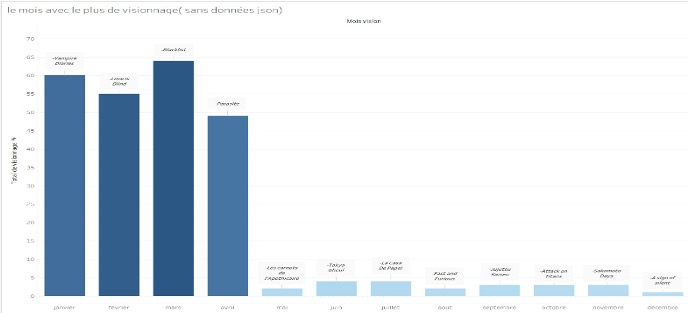

# Prime Video Database Project

## Objectif
Concevoir et analyser une base de données pour une plateforme de streaming afin d'améliorer les recommandations et l'expérience utilisateur.

## Compétences utilisées
- Modélisation de base de données (UML)
- SQL (requêtes complexes)
- Normalisation (3NF)
- Analyse de données
- Visualisation avec Tableau

## Travail réalisé
- Création d’un modèle relationnel complet (compte, profil, vidéo, abonnement, etc.)
- Conception et implémentation de requêtes SQL :
  - Analyse des genres populaires par pays
  - Analyse des visionnages par mois
  - Système de recommandation basé sur les favoris et langues
  - Détection des contenus bientôt indisponibles
- Création de triggers pour garantir la cohérence des données
- Visualisation des données avec Tableau

## Résultats
- Amélioration des recommandations utilisateurs
- Meilleure compréhension des comportements de visionnage
- Analyse des tendances selon les pays et périodes

## Visualisations

Voici quelques analyses réalisées avec Tableau :

###  Analyse des visionnages par mois
- Identification des mois avec le plus de visionnage
- Mise en évidence des contenus les plus populaires pour chaque période

###  Analyse des genres par pays
- Comparaison des préférences culturelles selon les pays
- Identification des genres dominants (anime, humour, action, etc.)

## Outils
- MySQL / SQL
- phpMyAdmin
- Tableau
