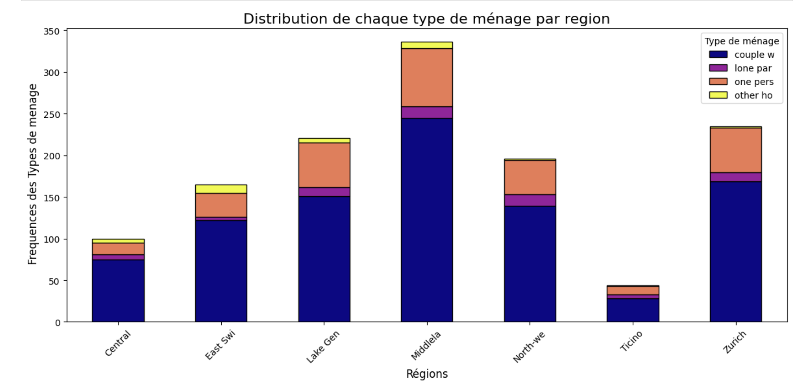
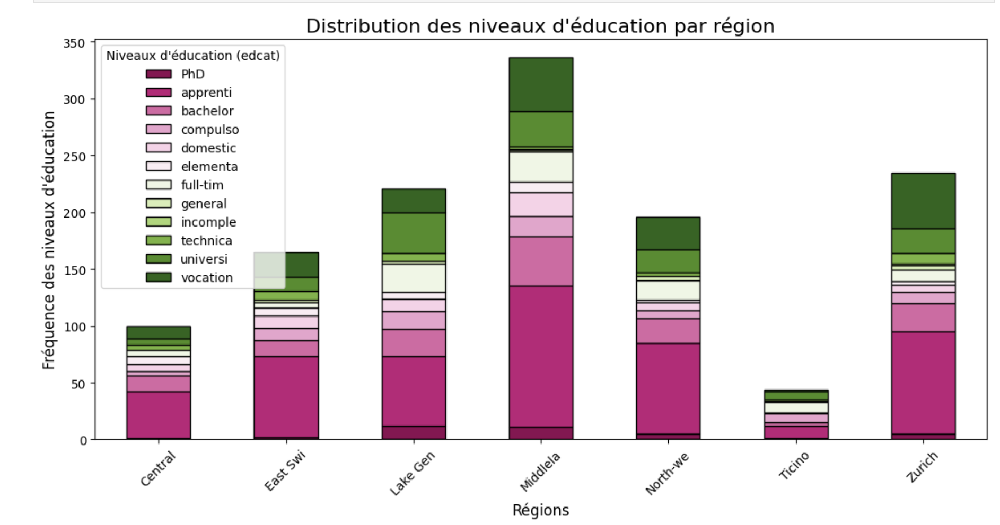
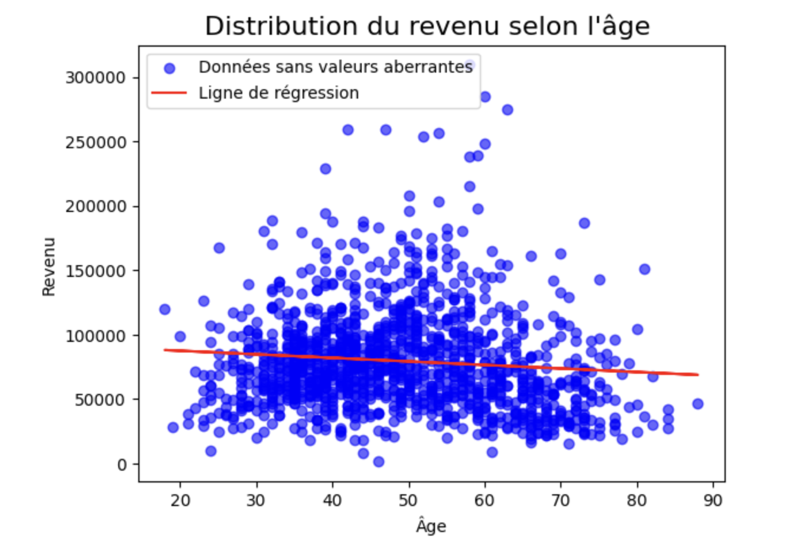
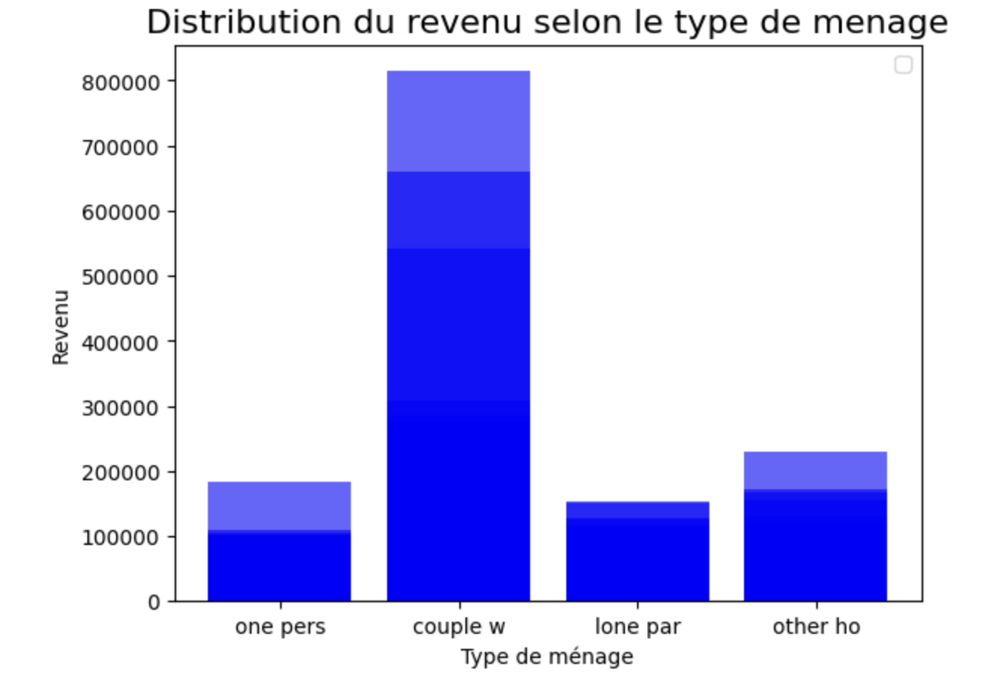

# Analyse des disparités de revenus en Suisse

## Objectif
Analyser les facteurs expliquant les disparités de revenus en Suisse selon :
- les régions
- l’âge et l’expérience
- le niveau d’éducation
- le type de ménage

## Problématique
Les revenus élevés sont souvent associés à l’éducation et à l’expérience. 
Cependant, cette analyse montre que ces relations ne sont pas toujours vérifiées en Suisse.

## Données et approche
- Analyse exploratoire des données
- Visualisations (graphiques)
- Régression linéaire (revenu vs âge)

## Résultats principaux

### 1. Disparités régionales
Le revenu moyen varie selon les régions :
- Zurich et la région centrale ont les revenus les plus élevés
- Le Tessin et certaines régions ont des revenus plus faibles

Cela montre une forte inégalité géographique.

### 2. Éducation et revenu
Contrairement aux attentes :
- Les régions avec le plus haut niveau d’éducation ne sont pas celles avec les revenus les plus élevés  
- Exemple : certaines régions très éduquées ont des revenus plus faibles que Zurich  

Les résultats suggèrent qu’il n’existe pas de relation directe évidente entre le niveau d’éducation et le revenu selon les régions.

### 3. Âge et expérience
La régression linéaire montre :
- une corrélation faible entre âge et revenu  
- une relation presque inexistante  

L’expérience n’explique pas significativement les revenus.

### 4. Type de ménage (facteur clé)
C’est le facteur le plus important :

- Les couples ont les revenus les plus élevés  
- Les personnes seules et familles monoparentales ont des revenus plus faibles
- Ces observations sont confirmées par la visualisation du revenu moyen par type de ménage.

Explication :
- partage des charges
- double source de revenu

### 5. Conclusion globale
Les inégalités de revenus en Suisse s’expliquent principalement par :
- la structure des ménages
- certains facteurs régionaux  

et non par :
- l’âge
- le niveau d’éducation (contrairement aux idées reçues)

## Implications
Ces résultats suggèrent que :
- les politiques sociales devraient soutenir les familles monoparentales et les personnes seules
- les inégalités ne sont pas uniquement liées au mérite individuel

## Visualisations

### Type de ménage par région

### Niveau d’éducation par région

### Revenu selon l’âge

### Revenu selon le type de ménage

## Technologies
- Python / Jupyter Notebook
- Analyse de données
- Visualisation (matplotlib / seaborn)
