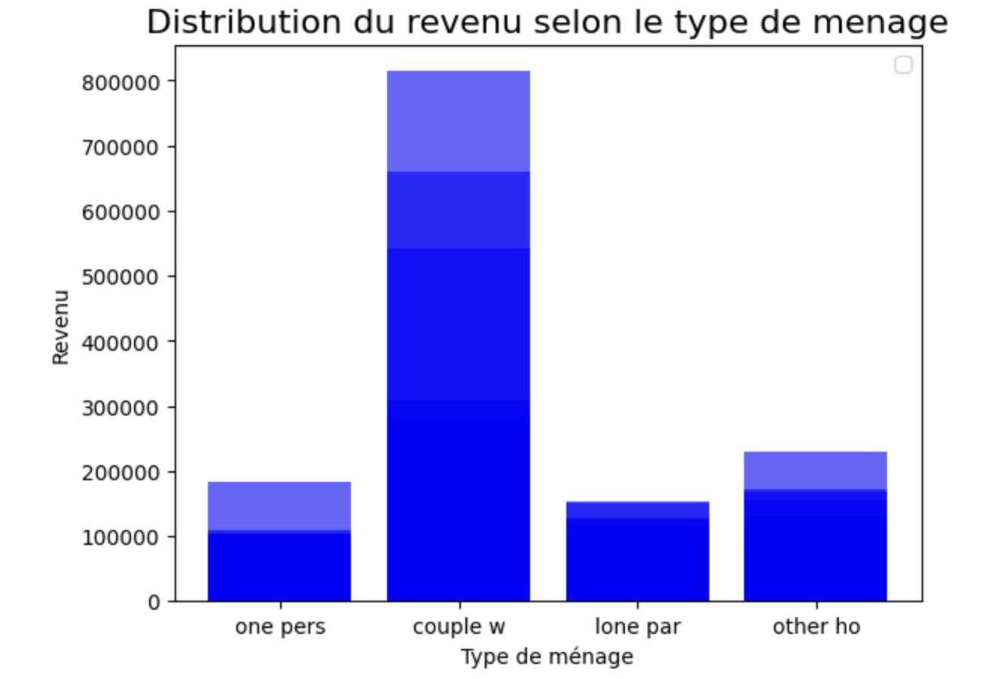
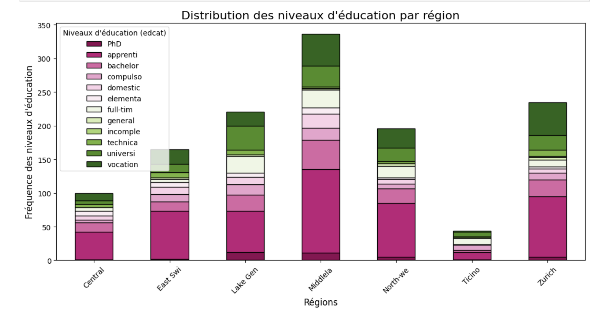
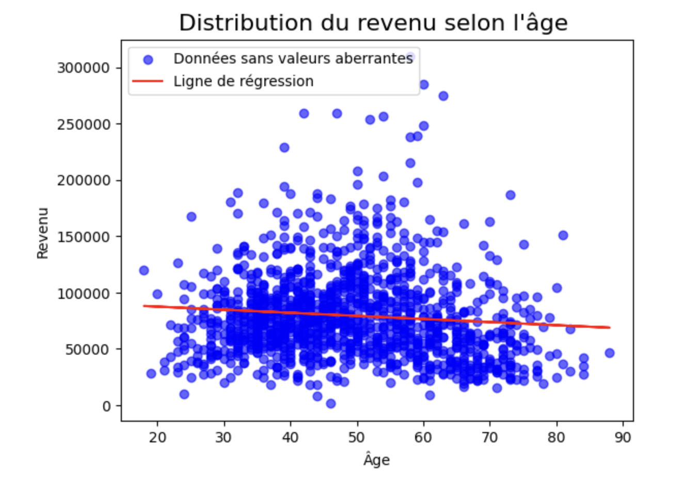
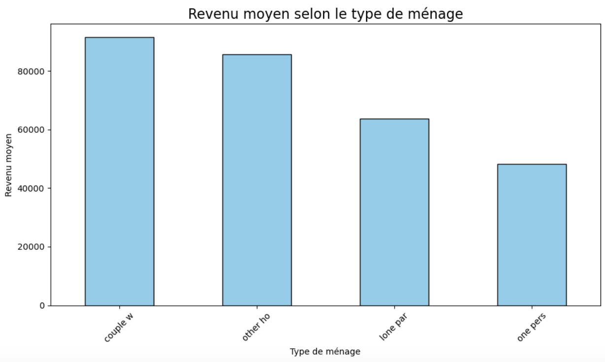
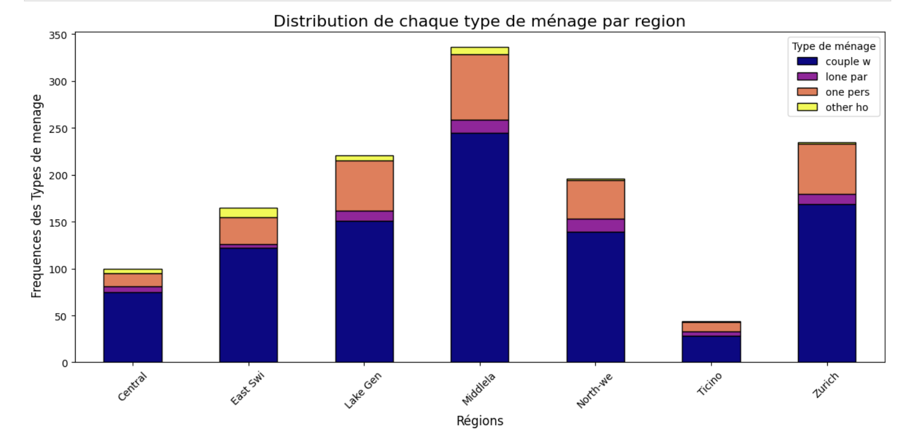

# Analyse des disparités de revenus en Suisse

## Objectif
Analyser les facteurs expliquant les disparités de revenus en Suisse en étudiant :
- les différences régionales
- l’influence de l’âge et de l’expérience
- le rôle du niveau d’éducation
- l’impact du type de ménage

---

## Problématique
Les revenus élevés sont généralement associés à un niveau d’éducation élevé et à l’expérience professionnelle.  
Ce projet vise à vérifier si ces relations sont effectivement observées dans les données en Suisse.

---

## Données et méthodologie
- Analyse exploratoire des données
- Visualisation de données
- Régression linéaire (revenu en fonction de l’âge)

Variables principales :
- revenu (`idispy`)
- âge (`age`)
- région (`region`)
- niveau d’éducation
- type de ménage (`hldtyp`)

---

## Résultats principaux

### 1. Disparités régionales

Le revenu moyen varie fortement selon les régions :
- Zurich et la région centrale présentent les revenus les plus élevés
- Le Tessin et certaines autres régions affichent des revenus plus faibles  

Ces observations mettent en évidence des inégalités géographiques importantes.

---

### 2. Éducation et revenu

Contrairement aux attentes :
- Les régions avec le niveau d’éducation le plus élevé ne sont pas celles avec les revenus les plus élevés  
- Certaines régions très éduquées présentent des revenus inférieurs à ceux de Zurich  

Les résultats suggèrent qu’il n’existe pas de relation directe évidente entre le niveau d’éducation et le revenu.

---

### 3. Âge et expérience

La régression linéaire entre l’âge et le revenu montre :
- une corrélation faible
- une relation peu significative  

L’expérience, mesurée par l’âge, n’explique pas à elle seule les différences de revenus.

---

### 4. Type de ménage : facteur déterminant

Le type de ménage apparaît comme le facteur le plus explicatif :

- Les couples présentent les revenus les plus élevés  
- Les personnes seules et les familles monoparentales ont des revenus plus faibles  

Ces résultats sont confirmés par l’analyse du revenu moyen selon le type de ménage.

---

### 5. Répartition des ménages et inégalités régionales

Les types de ménages varient selon les régions :
- certaines régions comptent davantage de couples
- d’autres présentent une proportion plus élevée de personnes seules ou de familles monoparentales  

Cette répartition contribue à expliquer les différences de revenus observées entre les régions.

---

## Conclusion

Les inégalités de revenus en Suisse s’expliquent principalement par :
- la structure des ménages
- des facteurs régionaux  

et beaucoup moins par :
- l’âge
- le niveau d’éducation  

Ces résultats remettent en question certaines idées reçues sur les déterminants du revenu.

---

## Implications

Les résultats suggèrent que :
- les politiques publiques devraient davantage soutenir les familles monoparentales et les personnes seules
- les inégalités ne sont pas uniquement liées au mérite individuel, mais aussi à des facteurs structurels

---

## Reproduction de l’analyse

1. Ouvrir le fichier `analysis.ipynb`
2. Installer les bibliothèques nécessaires :
   - pandas
   - matplotlib
   - seaborn
3. Exécuter les cellules pour reproduire les graphiques

---

## Technologies

- Python
- Jupyter Notebook
- Pandas
- Matplotlib / Seaborn
